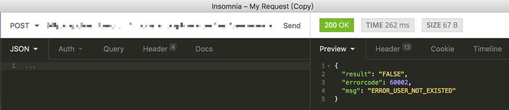
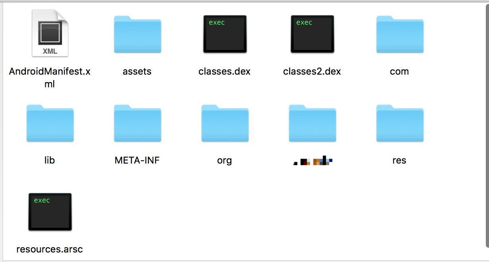
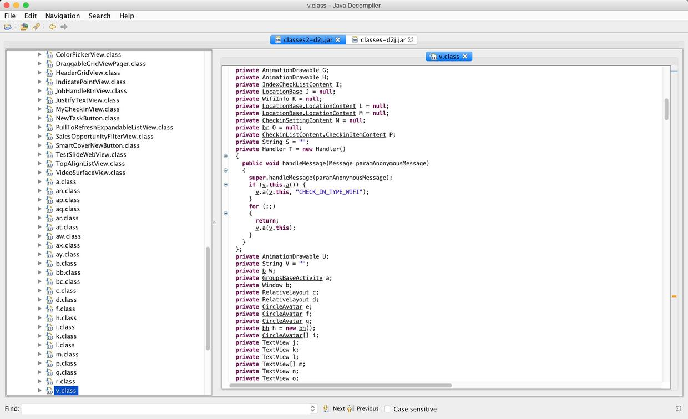
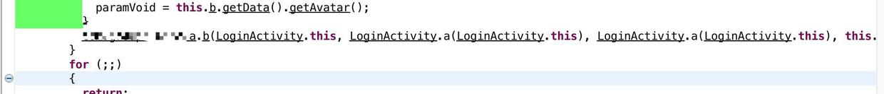
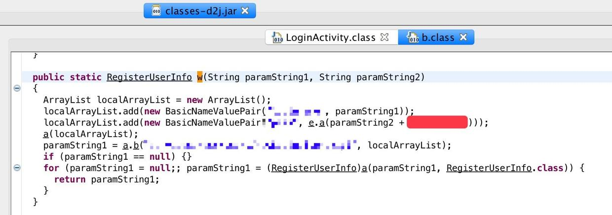
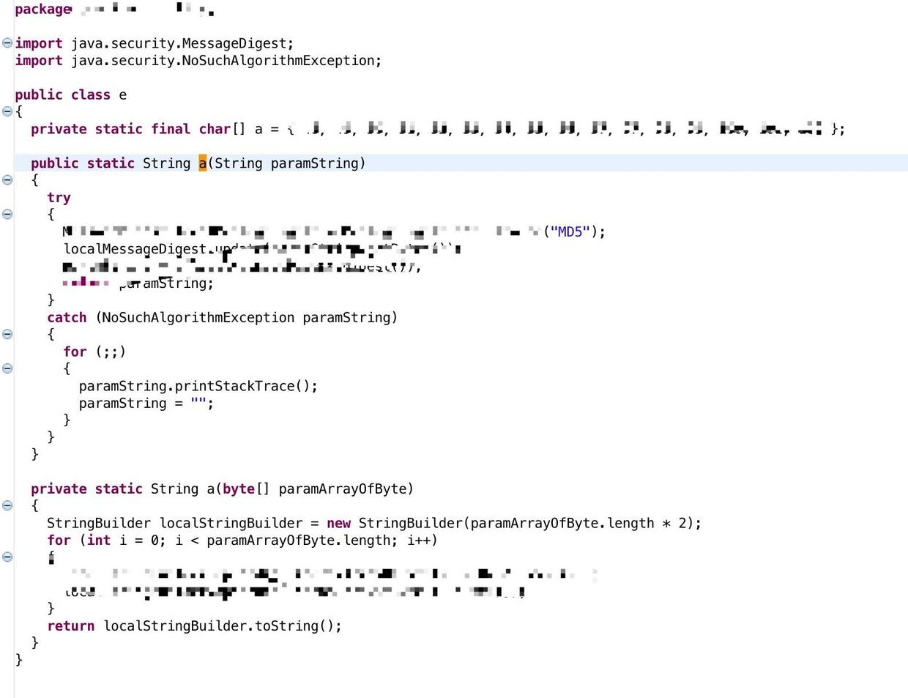
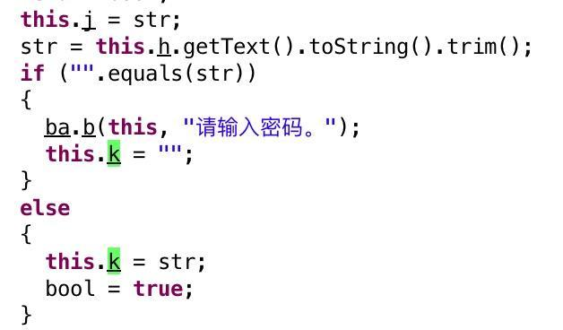
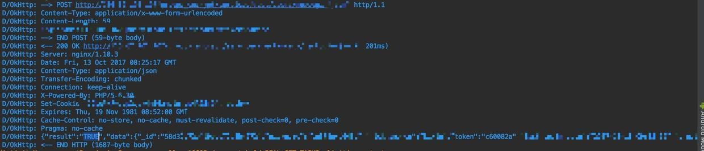

### 我不想我不想我不想迟到~

> 公司使用的是`xxapp`打卡。要想自己打卡， 那么我抓包获取接口和参数，自己组装，自己访问接口即可。
说干就干，我开始在登录界面进行抓包：
------


从图上可以发现：

- 在请求的时候，`herades` 里面有一些参数，包括了`custom-device-id`，`custom-version`，`custom-os`，`custom-company-id`，`x-json-web-token`等，这些内容是自定义`header`加上去的，后期调用接口时可能会用到
- 采用了`https`连接

------
既然XXX采用`https`方式，我们没有证书，就无法拦截获取信息，接口调用基本行不通了，那么我们采用`AccessibilityService`辅助功能的方式进行打卡如何呢？

> 思路是：将一台手机放到公司，连接网络，另一台手机远程`QQ`发送消息，公司这台手机接收到消息，点亮屏幕，向上滑动解锁，打开XXX，此时我们的打开`app`是在运行的，然后通过`AccessibilityService`进行辅助点击从而进行打卡。或者直接设置定时器，时间到之后自动触发以上过程并打卡。但这种思路对进程保活有相当高的要求，不太好实现。

----
使用`https`之前的XXX，肯定是`http`，那么`http`接口今安在？



居然`200`，而且从返回的`json`来看，登录接口对于服务器的逻辑来说是没问题的，应该是在使用中，那么下一步我们只需要拿到入参就行。

---
下一步，反编译`xxxx.apk`，用到的工具是`AndroidCrakTool`：


> 这里要提一下，反编译后我们能拿到资源文件们，资源文件对于定位页面，控件，以及此控件接下来的逻辑是至关重要很有帮助的。

- 反编译后，将`AndroidManifest.xml`和`res`文件夹留下，其他的删除即可，因为我们此次不对`smali`进行分析
- 另外，反编译后我们发现XXX并没有对代码进行加壳，只是单纯的混淆了。所以这就更加轻松简单

---
接下来，我们将`XXX.apk`后缀名改为`zip`，然后解压，得到如下内容：



可以看到，得到了两个`dex`文件，一个`classes.dex`和`classes2.dex`，这是因为他的方法数超过了`65536`，进行`multidex`的结果。现在我们使用`AndroidCrakTool`对这两个`dex`进行`dex2jar`，目的是将`dex`转成`jar`包，方便我们阅读源码。


得到`jar`包之后，我们用`JD-GUI`打开阅读，也可以使用`AS`或者`IDEA`进行源码阅读。这里采用`JD-GUI`。

---
打开这两个`jar`如下图：



> 现在来理一理思路，我们刚才测试的是登录接口，我们目的是打卡，那么我们就需要登录后，得到`token`，然后带上`token`和一大堆参数进行打卡接口的访问，所以第一步，我们需要得到登录接口的参数。

---

我们通过使用`TopActivity`，在手机上找到登录界面的`Activity`名字。

从设备左上角可以知道这个界面的名字和包名，所以我们在`JD-GUI`中找到对应的包名进入寻找登录界面。由于我们有两个`jar`，所以就先挨个找吧。但从顺序来说，这个登录界面一般会在`dex1`中，当然这也是猜测，不过一般按照代码量和顺序来看的话是这样的。果不其然，如下图：


> 从界面上看，我们是点击了`button`之后进行网络请求的，所以我们看成员变量，发现一个`button`，变量名`i`，然后紧接着下面有个`b()`方法，内部将`i`初始化了，`findviewbyid()`内部传入的正是这个`button`的`id`在`R`文件中的静态常量值。这里插一句，如果有需要对界面和`id`进行分析的话，就需要从这些`dex`中找到`R`文件，然后将这个`id`的数值拿去寻找匹配，就能在`R`文件中反向得到这个控件的`id`，然后将这个`id`拿到之前反编译后的`res`文件夹中搜索匹配，从而得到布局文件，控件`id`等。当然也能通过`AS`的`DDMS`进行布局分析，从而得到`id`，不过那个`id`是混淆后的，在`jar`中是无法找到的，因为`jar`中使用的`id`是`int`静态常量。

接下来我们将`i`变量的`id`值`2131362755`用来进行搜索，得到设置点击事件的地方。这里为何不直接用变量`i`呢？因为`i`是混淆后的，搜出来可能会有很多，不好排除。


从图上可以看到，我们找到了`onClick()`回调，并且找到了点击后的逻辑。图中有个方法，叫`executeOnExecutor()`，看起来像是`AsyncTask`的线程池执行方法，我们看看是不是，这时候点击前面`new b()`，看看这个`b`对象是啥，如下图：


可以看到果然是`AsyncTask`。那么结果就显而易见了，此次请求使用`AsyncTask`发起，所以我们在`AsynctTask`内部就能找到网络请求的相关内容了。先看第一个：
```
    protected Void a(Void... paramVarArgs){
          this.b = b.w(this.d, this.e);
          return null;
    }
```

此方法一看就知道，他是`doInBackground`方法混淆后的，因为他的返回值是`Void`而不是`void`。在这个`AsyncTask`实现的时候，泛型定义如下：
```
    private class b extends AsyncTask<Void, Void, Void>{}
```
三个`Void`，所以可以断定第一个`a()`方法是`doInBackground`。那么网络请求就在这里面了。再来看第二个`a()`方法。
```
    protected void a(Void paramVoid){}
```
从返回值和参数来看，可能是`onCancelled()`和`onPoseExcute()`，但是从整体代码和代码量来看，可以断定是`onPoseExcute()`：



---

现在回过头来分析`doInBackground()`。
```
    this.b = b.w(this.d, this.e);
```
我们点击`w()`进入看看：




可以看到，这个`b`对象的`w()`方法，就是组装登录接口所需参数的，登录接口需要`2`个参数，`最下面`那个是接口地址，`红色部分`是一串字符串。而通过大码部分的字符串，我们可以知道第二个参数是密码，那么后面跟一串字符串是什么呢？是不是加密？，我们点击`e.a()`中的`a()`方法去看看：





从图上可以看到`a()`方法接收一个参数，联系刚才组装数据的地方，可以知道，密码是`由明文加后面红色部分字符串`，再整体经过`MD5`加密之后的。至于为何知道是明文密码，我们返回到`LoginActivity`，在`AsyncTask`实例化的时候传入了两个参数，后者就是密码。这个密码字符串的获取方式是反推出来的，如下图：




所以，现在我们有了接口地址，参数，加密方式，我们试试看能否访问成功。

经过调试，登陆成功，`server`返回了一堆数据，其中包括了`token`,`id`等：



我们现在相当于完成了`50%`。

> 接下来的步骤要比之前简单太多了。通过抓包，获取到打卡接口的大概路径，然后在刚才组装登录接口参数的`b`类中，查询匹配这个接口地址，于是得到了打卡的完整接口地址。并且得到了入参。剩下的就是慢慢组装数据了。我们需要打卡，那么就需要经纬度。通过反编译发现他是用的是高德地图，于是我们使用高德的地理位置反编码，将我们想打卡的位置的经纬度得到，然后传入参数体，从而实现登录并打卡。

---

> 其实整个过程走下来，最主要的几个点：
  - 在替换成`https`后，原`http`接口未关闭，可能是为了兼容老版本
  - `apk`未进行更深层的保护，仅仅只是混淆
  - 密码加密的关键信息未进行有效保护，直接暴露了出来

--- 

最后，这次尝试主要是利用了`http`接口未关闭的漏洞，其实说到底也就是一次抓包分析数据的过程。

---

- 以上敏感信息均做打码处理
- `app`名字也替换成了`XXX`
- 请勿用作商业用途和非法途径，仅供学习参考
- 如有侵权，联系我删除

